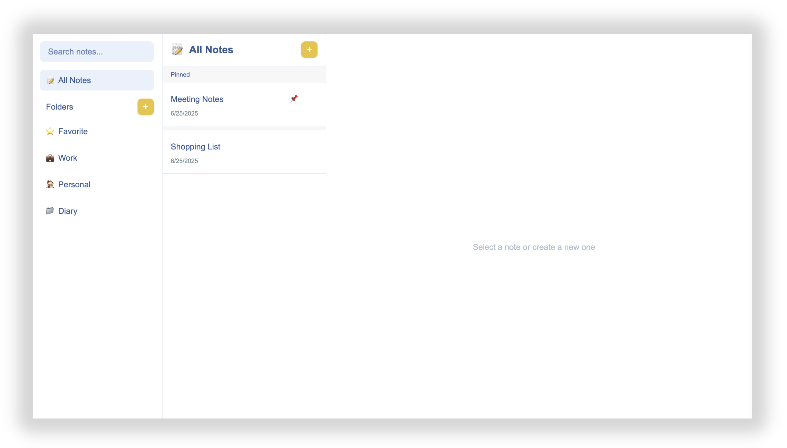
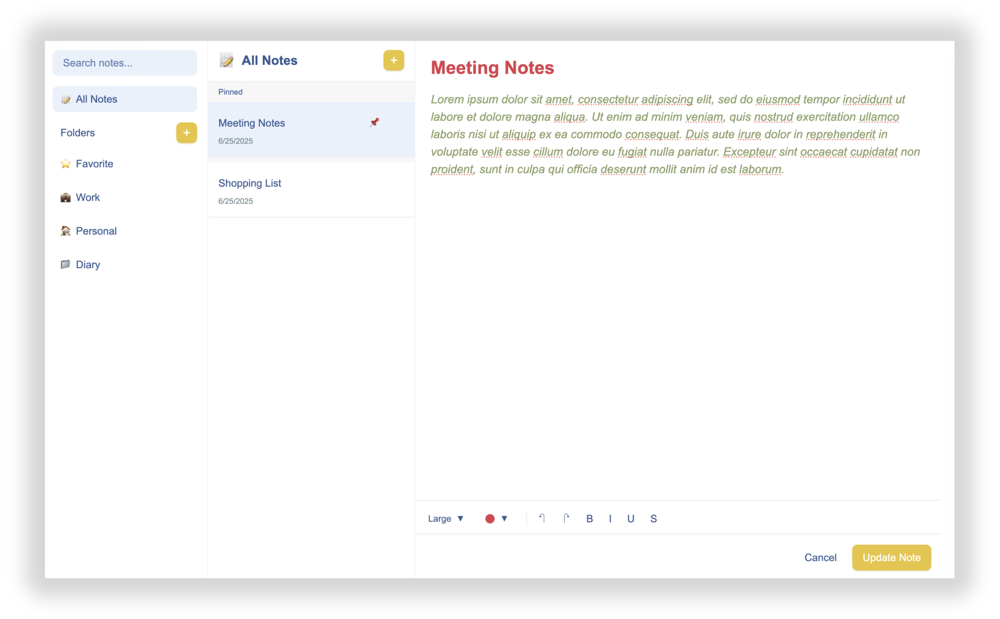

# 📝 Note Taking App

A modern, feature-rich note-taking application built with **Next.js** and **React**. Create, organize, and style your notes with an intuitive interface and powerful formatting tools.

## ✨ Features

### 📁 **Folder Management**

- Create custom folders to organize your notes
- Default "All Notes" view to see everything at once
- Easy folder navigation with icons and names

### 📝 **Rich Text Editing**

- **Bold**, _Italic_, <u>Underline</u>, and ~~Strikethrough~~ formatting
- Color picker with custom color palette
- Font size adjustment (5 different sizes)
- Undo/Redo functionality

### 🎨 **Title Styling**

- Independent title formatting
- Custom colors, fonts, and styles for titles
- Real-time preview of formatting changes

### 💾 **Smart Saving**

- Auto-save functionality
- LocalStorage persistence
- HTML formatting preservation
- Title and content styling retention

### 🔍 **Search & Organization**

- Search functionality across all notes
- Note snippets for quick preview
- Date-based organization
- Pin important notes





## 🚀 Getting Started

### Prerequisites

- Node.js 18+
- npm, yarn, pnpm, or bun

### Installation

1. **Clone the repository**

   ```bash
   git clone <repository-url>
   cd note-taking-app
   ```

2. **Install dependencies**

   ```bash
   npm install
   # or
   yarn install
   # or
   pnpm install
   ```

3. **Run the development server**

   ```bash
   npm run dev
   # or
   yarn dev
   # or
   pnpm dev
   # or
   bun dev
   ```

4. **Open your browser**
   Navigate to [http://localhost:3000](http://localhost:3000)

## 🛠️ Built With

- **[Next.js 14](https://nextjs.org)** - React framework
- **[React 18](https://reactjs.org)** - UI library
- **[Tailwind CSS](https://tailwindcss.com)** - Styling
- **LocalStorage** - Data persistence

## 📱 Usage

### Creating Notes

1. Click the "+" button next to a folder
2. Add your title and content
3. Use the formatting toolbar for styling
4. Click "Save Note" to persist

### Formatting Text

- **Select text** in the content area
- **Choose colors** from the color picker
- **Adjust font size** with the size dropdown
- **Apply formatting** with Bold, Italic, Underline buttons

### Title Styling

1. **Click on the title field** to activate title mode
2. **Use formatting tools** to style the title
3. **Colors and sizes** are applied independently

### Folder Management

1. **Create folders** with the "+" button in the sidebar
2. **Organize notes** by dragging them to folders
3. **Rename or delete** folders with right-click menu

## 🎯 Key Features Explained

### Rich Text Editor

The app uses `contentEditable` with `document.execCommand` for rich text formatting, combined with React state management for reliable saving.

### Style Persistence

Both title and content formatting are saved using:

- **CSS styles** for colors, fonts, and sizes
- **HTML formatting** for bold, italic, underline
- **`dangerouslySetInnerHTML`** for proper rendering

### Responsive Design

Built with Tailwind CSS for a responsive, modern interface that works on desktop and mobile devices.

## 🔧 Technical Implementation

### State Management

- React hooks for local state
- LocalStorage for persistence
- Real-time updates across components

### Styling Architecture

- Tailwind CSS for utility-first styling
- Custom color palette integration
- Dynamic style application

### Data Flow

```
User Input → React State → LocalStorage → UI Update
```

## 🤝 Contributing

1. Fork the repository
2. Create your feature branch (`git checkout -b feature/amazing-feature`)
3. Commit your changes (`git commit -m 'Add amazing feature'`)
4. Push to the branch (`git push origin feature/amazing-feature`)
5. Open a Pull Request

## 📄 License

This project is open source and available under the [MIT License](LICENSE).

## 🙏 Acknowledgments

- Built with [Next.js](https://nextjs.org) framework
- Styled with [Tailwind CSS](https://tailwindcss.com)
- Icons and UI inspiration from modern note-taking apps

---

**Enjoy taking notes! 📝✨**
